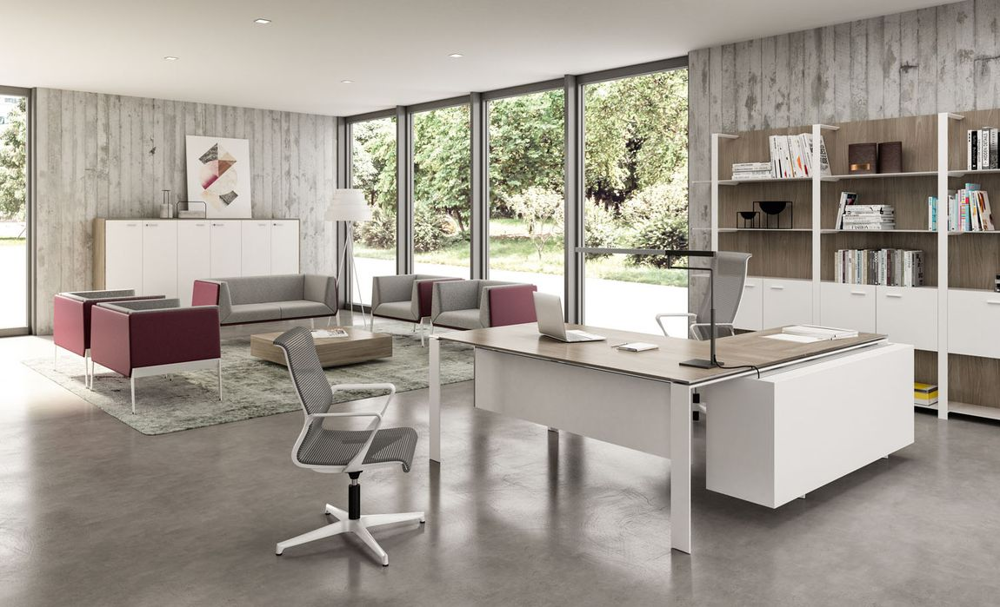

# FurniSmart-Solutions Sales Data

FurniSmart Solutions is a visionary and innovative fictional company specializing in the realm of office equipment supplies and contemporary office furniture. Committed to providing cutting-edge, ergonomic, and stylish solutions, FurniSmart is dedicated to enhancing workspace functionality and aesthetics. With a diverse range of products, from ergonomic chairs and desks and office accessories, FurniSmart Solutions sets the standard for workspaces that inspire comfort and efficiency.

In my role as a Data Analyst, my responsibility extended to creating detailed reports that shed light on FurniSmart Solutions' current operations and serve as vital resources for crafting effective strategies. It's worth noting that the data used in these reports is entirely fictitious, providing a simulated yet valuable representation of the insights that FurniSmart Solutions could gain from this analysis.

1. **THE BUSINESS QUESTIONS** 

These business questions cover the sales, operations and strategy aspects. By analyzing the datasets, FurniSmart Solutions can gain insights and make data-driven decisions to improve their overall performance and competitiveness.

- **In which month of the year did the company generated the highest profit?**

  
According the analysis, The table presents a monthly summary of sales and profit data. November and December stand out as peak sales months, with  $352,461.07 and $325,293.50 in sales, respectively. December records the highest profit of $43,369.19, likely due to holiday such as Christmas which often lead to increased consumer spending. The analysis reveals a positive correlation between sales and profit, where higher sales generally result in higher profits. While February has the lowest sales, it still boasts a relatively high profit of $10,294.61, suggesting efficient cost management. This data emphasized the importance of capitalizing on peak sales months and implementing strategies to maintain profitability throughout the year.

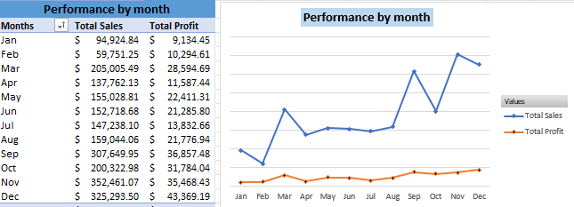

- **What is the effect of shipping processing time and shipping mode on customer retention?**

The analysis highlights a concerning trend where a significant number of 1st and 2nd class shipping orders experience delays compared to standard class shipments. Such discrepancies in delivery times could potentially lead to customer dissatisfaction. It's advisable for FurniSmart Solutions to proactively address this issue as it may impact customer retention.

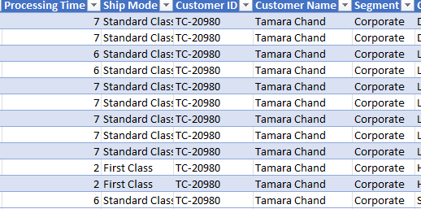

To resolve this, a review of the terms of the contract between the delivery company and the sales company is essential. Ensuring timely and consistent delivery is crucial for maintaining customer satisfaction and loyalty. Additionally, a strategic move might involve establishing a warehouse closer to the highest revenue-generating region. This adjustment can significantly reduce delivery timelines, improving overall customer experience and operational efficiency. By taking these measures, FurniSmart can enhance its service quality and customer retention rates.

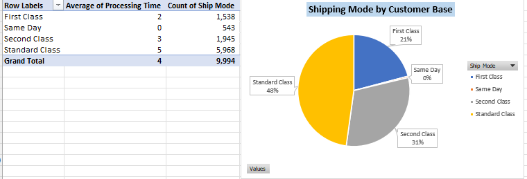

- **Who is the most valuable customer?** 

Tamara Chand, our most lucrative customer, contributed a substantial profit of $8,981.32 to our business. Her loyalty was evident, having made 12 repeated purchases. However, it's essential to highlight that she consistently opted for the standard shipping mode, which typically promises delivery within 5 days. Surprisingly, her orders took longer than 5 days to arrive. This delay could have led to her discontinuing business with us in 2017. To retain valuable customers like Tamara, it's recommended to ensure that we meet delivery timeframes consistently, especially for those who opt for standard shipping, to enhance their overall experience and loyalty.
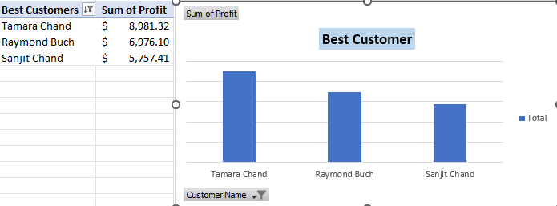

- **Which Segment and City has the highest and lowest revenue?**

This metric serves as a critical evaluation of the top revenue-generating cities in contrast to those cities that contribute the least revenue. 
The top three cities leading in revenue generation are identified as New York, Los Angeles, and Seattle, with the Consumer segment notably contributing the most revenue. As a Data Analyst, I strongly recommend that these top three cities consider increasing their supply to meet the high demand in these areas. By doing so, they can optimize their profit potential and enhance their market presence.

On the other end of the spectrum, the least revenue-generating cities include San Antonio, Houston and Philadelphia. Based on the data analysis, I propose the strategic closure of sales outlets in cities where the sales revenue falls below the $100 mark. This recommendation stems from the observation that the majority of these outlets are operating at a loss, and the profits generated are insufficient to cover the associated overhead costs. By implementing this course of action, the business can redirect resources to more profitable regions and strengthen its overall financial health.

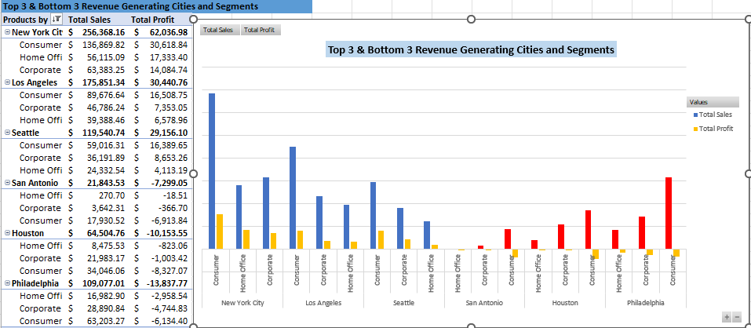

- **What are the best performing and least performing products by category?** 

This analysis focuses on identifying the best and worst-performing products within each category. By evaluating sales, profit, and other relevant metrics, it aims to uncover the products that excel in their respective categories and those that may require improvement. The findings can guide strategic decisions, such as optimizing the marketing or inventory management of top-performing products and exploring ways to enhance the performance of those in underperforming categories. This insight-driven approach will empower FurniSmart Solutions to allocate resources more efficiently and strengthen their product portfolio for improved overall performance.

- Technology Category:  

Among the products in the Technology category, the Canon Image copier emerges as the top-performer, demonstrating a remarkable performance with impressive profit of $25,199.93. In stark contrast, the least performing product is the Cubify Cubex 3D printer, unfortunately incurring the highest loss of $8,878.97. These findings underscore the significance of focusing on products with exceptional performance while addressing areas of concern to optimize profitability.

- Office Supplies:

In this office category, the standout product is the Fellowes PB500 Binding machine, contributing significantly with total sales of $7,753.04. On the contrary, the GBC DocuBind electric binding system is the weakest performer, incurring the highest loss of $1,878.17. To optimize profitability, consider focusing on promoting and possibly expanding the product range of high-performing items like the Fellowes PB500, while reassessing the viability of underperforming products like the GBC DocuBind for potential improvements or discontinuation.

- Furniture Category:

The data analysis reveals valuable insights into the product category's performance. Notably, the Deluxe Fabric Chair stands out as the top performer, yielding the highest profit of $1,927.44. On the other hand, Chromecraft conference tables and bases experienced significant losses, amounting to $2,876.12.

A concerning revelation is that out of the 9,994 products within the category, a substantial 304 products are operating at a loss. To optimize profitability, it is recommended to discontinue these underperforming products. By doing so, the FurniSmart Solutions can focus its resources, efforts, and budgets on strengthening the best-performing products.

Redirecting budgets from loss-making products to top performers is a strategic move that can drive growth, enhance the overall financial health, and enable better resource allocation. This approach ensures that the company capitalizes on its strengths and mitigates weaknesses within the product category.

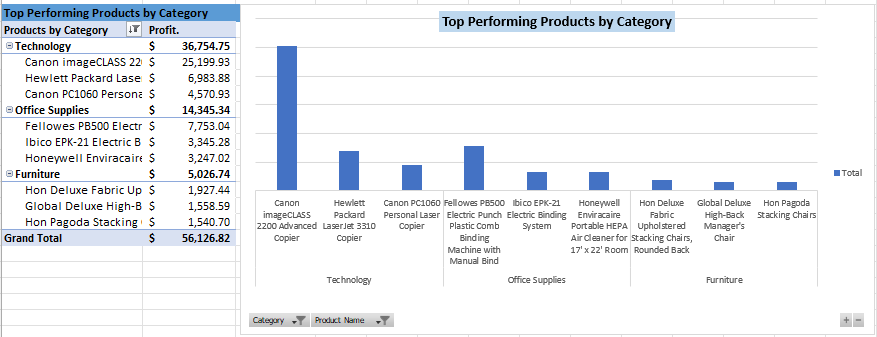

- **Over the last 4 years, how much profit have FurniSmart achieved?** 

FurniSmart's financial performance has displayed a notable upward trend over the past four years, spanning from 2014 to 2017. This progression is evident in the annual profit figures, which have consistently risen during this period. In 2014, FurniSmart Solutions recorded a profit of $49,543.97, which increased to $61,618.60 in 2015, further climbing to $81,795.17 in 2016, and ultimately peaking at $93,439.27 in 2017.

This positive trend in profit growth reflects the company's effective strategies, improved market positioning, or operational efficiency. To maintain and build upon this success, it is advisable for   to continue focusing on its core strengths, exploring opportunities for diversification, and managing costs to ensure long-term profitability.

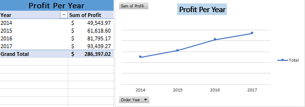

2. **KEY PERFORMANCE INDICATORS**

Key Performance Indicators (KPIs) are essential metrics that can be used to assess the performance and strategies of FurniSmart Solutions. They provide valuable insights into the sales effectiveness and help drive decision-making.

- Total Revenue
  
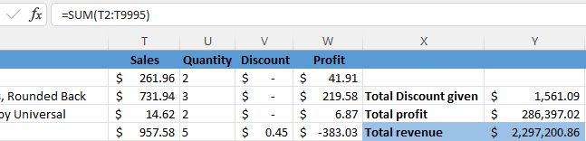

The Total Revenue, which stands at $2,297,200.86, serves as a pivotal Key Performance Indicator (KPI) in evaluating overall FurniSmart's financial health. 

- Profit Margin
  
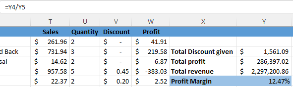

The Profit Margin of 12.47% signifies that for every dollar of revenue, the company retains about 12.47 cents as profit after covering expenses. With a Total Revenue of $2,297,200.86 and a Total Profit of $286,397.02, it's evident that the company is running profitably. To enhance profitability, focus on cost control and revenue growth strategies, potentially through expanding into higher-margin product lines or increasing sales in regions or segments with higher profitability.

- Sales Growth Rate

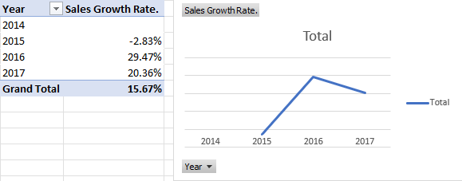

Over the years, the company's sales have experienced fluctuations. In 2015, there was a decline of 2.83%, followed by substantial growth in 2016 and 2017, with growth rates of 29.47% and 20.36% respectively. To sustain and improve performance, it's crucial to identify the factors contributing to the fluctuations. A drop in 2015 suggests a potential issue that needs attention, while the subsequent growth indicates resilience and adaptability. 

- Total Discount Given

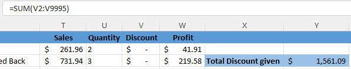

The total discount given by FurniSmart Solution, amounting to $1,561.09, is a crucial metric to consider in conjunction with the Total Revenue of $2,297,200.86 and Total Profit of $286,397.02.
While discounts can attract customers, it's vital to ensure they don't overly impact profitability. To optimize profitability, it's recommended to monitor and manage discounts closely. 

**

